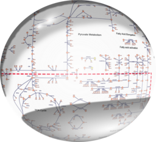

# ModelPolisher 
**Annotating Systems Biology Models**



[](https://github.com/draeger-lab/ModelPolisher/releases/)
[](https://doi.org/10.1371/journal.pone.0149263)
[](http://opensource.org/licenses/MIT)

ModelPolisher is a simple single-purpose automated curation tool for SBML models.

- improve the adherence to [FAIR]((https://doi.org/10.1038%2FSDATA.2016.18)) data standards as practiced in the SBML modelling community
- implement non-binding best practices as defined by the [SBML specification](https://sbml.org/documents/specifications/) documents
- add [MIRIAM]((https://doi.org/10.1038%2Fnbt1156))-style semantic annotations to models, using the [BiGG Models knowledgebase](http://bigg.ucsd.edu) and [AnnotateDB](https://github.com/matthiaskoenig/annotatedb)

You can find documentation on what ModelPolisher does in [our Wiki](https://github.com/draeger-lab/ModelPolisher/wiki).

Furthermore, it can, on a best effort basis, attempt to perform minimal fixes on a model to make it valid with regards to the [SBMLValidator](https://sbml.org/jsbml/files/doc/api/1.6.1/org/sbml/jsbml/validator/SBMLValidator.html).

Again, you find comprehensive documentation on this in [our Wiki](https://github.com/draeger-lab/ModelPolisher/wiki).

Currently supported versions of the SBML standard are:

- Version 3 Level 1
  - FBC Version 2

You can use ModelPolisher as a tool via its [Python API client](https://github.com/draeger-lab/MPClient) to our HTTP server, or locally using Docker or as a Standalone JAR.

ModelPolisher can also be used as a Java library, building on the [JSBML](https://sbml.org/software/jsbml/) project.

# Table of Contents

* [Performance](#performance)
* [Using ModelPolisher as a Tool](#using-modelpolisher-as-a-tool)
  * [Parameters](#parameters)
  * [Using the Python API package](#using-the-python-api-client-package)
  * [Using Docker](#using-docker)
  * [Using ModelPolisher Jar](#using-modepolisher-jar)
* [Using ModelPolisher as a Java library](#using-modelpolisher-as-a-java-library)
* [How to cite ModelPolisher](#how-to-cite-ModelPolisher)
* [Licenses](#licenses)

# Performance
An evaluation of running ModelPolisher on all models in the BiGG Database, on 3000 models available on Biomodels and on newly generated models using [CarveMe](https://github.com/cdanielmachado/carveme) with regards to [MEMOTE](https://memote.readthedocs.io/en/latest/) scores will be published shortly.

# Using ModelPolisher as a Tool
We recommend users to either use the [Python API client package](#using-the-python-api-client-package) or run ModelPolisher [using `docker`](#using-docker).

However, ModelPolisher can also be run [from the ModelPolisher `Jar`](#using-jar).

## Using the Python API client package
If you don't want to process large numbers of models and have an internet connection available, this is the recommended usage.

ModelPolisher is hosted as an HTTP server at [biodata.informatik.uni-halle.de/modelling/polisher](biodata.informatik.uni-halle.de/modelling/polisher).

We provide a [Python API client package](https://github.com/draeger-lab/MPClient) (available on PyPI) for interaction with the server. All documentation regarding usage of the API client can be found in that repository.

## Using ModelPolisher Locally
ModelPolisher can also be run locally.

If you want to process a large number of models, or you don't feel comfortable using the Python API client package, this is the recommendend usage.

### Parameters
Parameters can be passed via a [json file](app/examples/config.json) or as command line arguments.

See [the Wiki](https://github.com/draeger-lab/ModelPolisher/wiki/Parameters) for more information.

### Using Docker
ModelPolisher is provided as a Docker image.

This repository contains a [`docker-compose.yml`](app/docker-compose.yml) which also sets up BiGG DB and AnnotateDB as Docker containers, to support the [annotation functionality](https://github.com/draeger-lab/ModelPolisher/wiki/Annotation).

For a single model file, you can use
``` shell
docker-compose run \
	-v <path_to_directory_containing_models>:/models/ \
	-v <path_to_config_json>:/config.json \	
	polisher \
	--input=/models/<model_name> \
	--output=/models/output/<output_name> \
	--config-file /config.json
```

Output will be produced in directory `<absolute_path_to_directory_containing_models>/output`.

*Note*: It is always recommended to [run Docker as your current user](https://docs.docker.com/engine/install/linux-postinstall/#manage-docker-as-a-non-root-user) and not as root. Running as root will produce root-owned output. Users can use `-u <username_or_uid>` with `docker-compose run` to generate output with correct ownership in this case.

### Using ModelPolisher Jar
You can run ModelPolisher using its `Jar `.
See [Releases](https://github.com/draeger-lab/ModelPolisher/releases/latest) for downloads of stable versions of standalone Jars and the [Parameters](https://github.com/draeger-lab/ModelPolisher/wiki/Parameters) Wiki page for documentation of the input parameters.

If the [annotation functionality](https://github.com/draeger-lab/ModelPolisher/wiki/Annotation) is required, users need to provide connections to the [BiGG](https://github.com/SBRG/bigg_models) Database and/or [AnnotateDB](https://github.com/matthiaskoenig/annotatedb) as `PostgreSQL` databases.

This can be achieved like this:
```
java -jar "<path>/ModelPolisher/target/ModelPolisher-2.1.jar" --config-file config.json
```

Note: ModelPolisher requires Java `version >= 17`.

# Using ModelPolisher as a Java library
ModelPolisher and some of its dependencies are currently hosted in a [Maven repository](https://biodata.informatik.uni-halle.de/maven/#/releases/edu/ucsd/sbrg/ModelPolisher) by the BioDatA working group of the University of Halle. We intend to move this to Maven Central in due time.

You can see our [GitHub Pages](http://draeger-lab.github.io/ModelPolisher/) for its Javadocs.

# How to cite ModelPolisher
The online version of ModelPolisher is described in this article: http://journals.plos.org/plosone/article?id=10.1371/journal.pone.0149263

The article ["BiGG Models: A platform for integrating, standardizing and sharing genome-scale models"](https://nar.oxfordjournals.org/content/44/D1/D515) describes BiGG Models knowledge-base including ModelPolisher.

# Licenses
ModelPolisher is distributed under the MIT License (see LICENSE).
An Overview of all dependencies is provided in [THIRD-PARTY.txt](https://github.com/draeger-lab/ModelPolisher/blob/master/THIRD-PARTY.txt), their respective licenses can be found in the [licenses](./licenses) folder.


